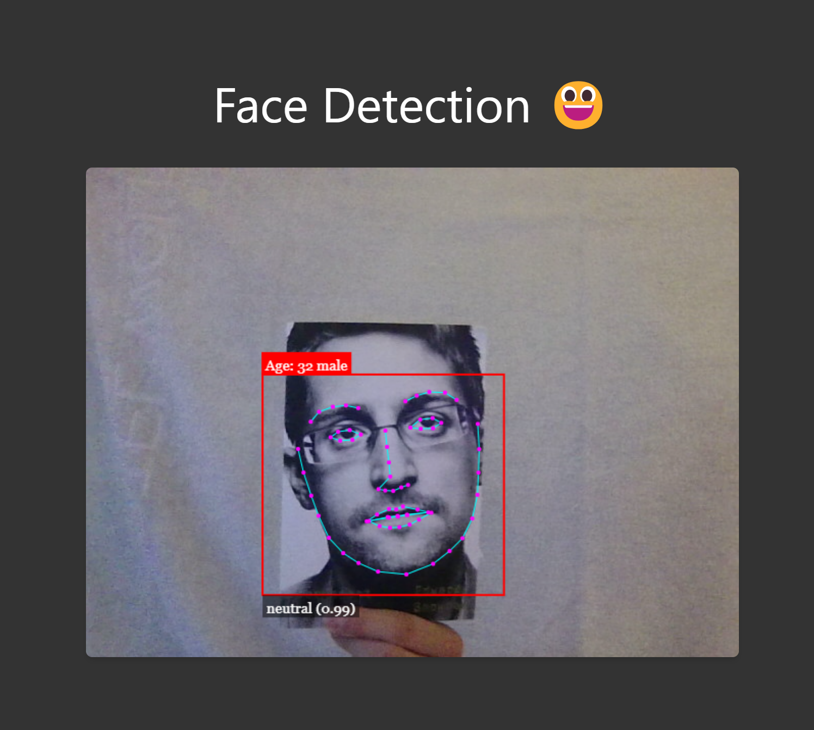

# Face Detection

This is a simple face detection app using face-api.js. It can detect faces in real-time using your webcam.

Technologies that i used:

- React
- Tailwind CSS

 

# How to run the project

1. Clone the repository
2. Run `npm install`
3. Run `npm run dev`
4. Open `http://localhost:5173/` in your browser

 
 

